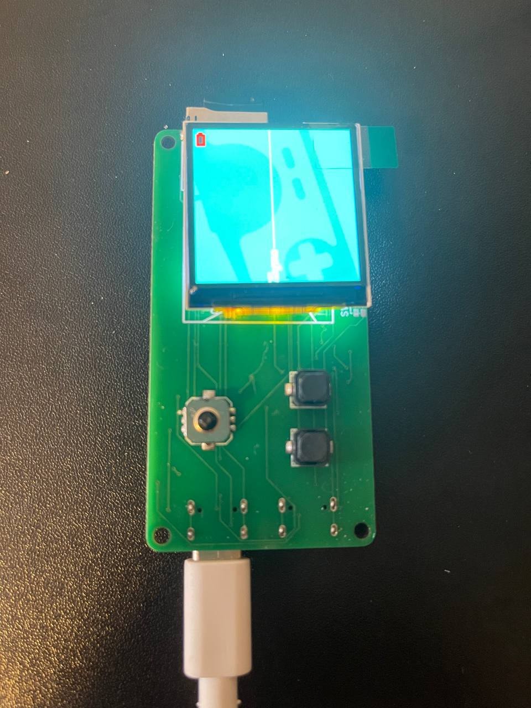
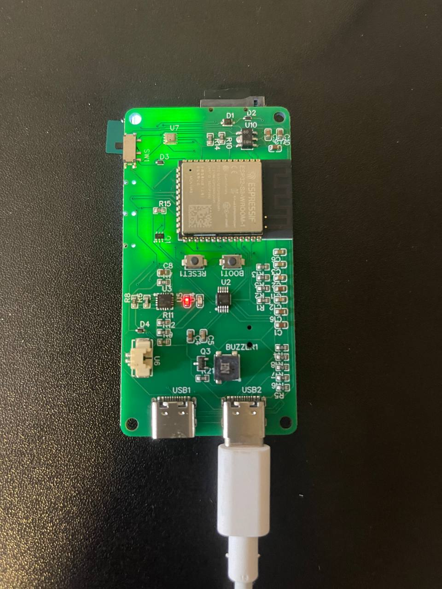
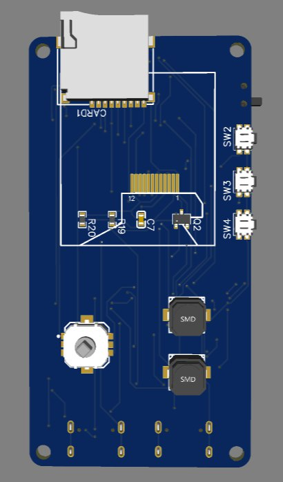
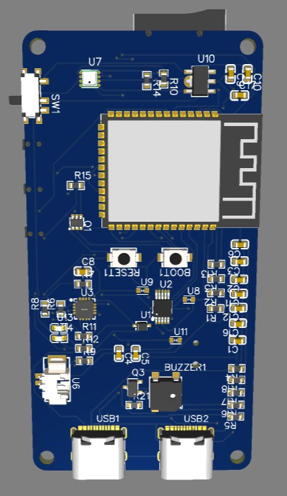

# ESP32-S3 CyberBox – Hardware Documentation

> **Project**: ESP32-S3 CyberBox  
> **MCU**: ESP32-S3-WROOM-1 (N16R8)  
> **Schematic**: EasyEDA – Sheet 1/1  
> **Revision**: v1.0 (2025-12-09)

---
### Screenshots




## 1. Project Overview

CyberBox là một thiết bị nhúng dựa trên **ESP32-S3**, tích hợp:

* Màn hình TFT ST7789 (SPI)
* Thẻ nhớ microSD (SPI)
* Cảm biến môi trường BME280 (I²C)
* USB-C (native USB + USB-UART CH340)
* Pin Li-ion + mạch sạc BQ24074
* Joystick, buttons, buzzer

Tài liệu này mô tả **pin mapping**, **kiểm tra xung đột GPIO** và **các lưu ý phần cứng** để phục vụ phát triển firmware và public trên GitHub.

---

## 2. ESP32-S3 GPIO Pin Mapping

### 2.1 TFT Display – ST7789 (SPI)
```c
// ###### CẤU HÌNH KÍCH THƯỚC ######
#define TFT_WIDTH  240
#define TFT_HEIGHT 240

// ###### CẤU HÌNH CHÂN KẾT NỐI (Sơ đồ bạn cung cấp) ######
#define TFT_BL   39       // Chân LEDK
#define TFT_DC   47       // Chân D/C
#define TFT_CS   14       // Chân CS
#define TFT_SCLK 48       // Chân SCL
#define TFT_MOSI 12       // Chân SDA
#define TFT_RST  3        // Chân RESET
#define TFT_MISO -1        // Không dùng chân MISO
```

| Function   | GPIO   | Notes             |
| ---------- | ------ | ----------------- |
| BL / LED   | GPIO39 | Backlight control |
| D/C        | GPIO47 | Data / Command    |
| CS         | GPIO14 | Chip Select       |
| SCL / SCK  | GPIO48 | SPI Clock         |
| SDA / MOSI | GPIO12 | SPI MOSI          |
| RESET      | GPIO3  | Display reset     |

---

### 2.2 Buttons

```c
// GÁN LẠI CHÂN ĐỂ JOYSTICK DỄ SỬ DỤNG HƠN
 #define BTN_UP    40 // Joystick D 
 #define BTN_DOWN  5 // Joystick B 
 #define BTN_LEFT  4  // Joystick A 
 #define BTN_RIGHT 45  // Joystick C 
 #define BTN_A     37 // KEY2 (OK) 
 #define BTN_B     36 // KEY1 (Back) 
```

| Button | GPIO   | Notes      |
| ------ | ------ | ---------- |
| UP     | GPIO40 | Input      |
| DOWN   | GPIO5  | Input      |
| LEFT   | GPIO4  | Input      |
| RIGHT  | GPIO45 | Input-only |
| A      | GPIO37 | Input-only |
| B      | GPIO36 | Input      |

---

### 2.3 microSD Card (SPI)

| ESP32-S3 GPIO | microSD Pin | Notes       |
| ------------- | ----------- | ----------- |
| GPIO10        | CD/DAT3     | Chip Select |
| GPIO11        | CMD         | MOSI        |
| GPIO13        | CLK         | SPI Clock   |
| GPIO9         | DAT0        | MISO        |
| GPIO38        | DET         | Card Detect |

---

### 2.4 Environment Sensor – BME280 (I²C)

| ESP32-S3 GPIO | BME280 | Function  |
| ------------- | ------ | --------- |
| GPIO6         | SCL    | I²C Clock |
| GPIO18        | SDA    | I²C Data  |

---

### 2.5 Buzzer

| ESP32-S3 GPIO | Component   | Function   |
| ------------- | ----------- | ---------- |
| GPIO41        | Q2 → Buzzer | PWM / Beep |

---

### 2.5 Battery
 #define PIN_BAT  1 
 #define D+ 20 
 #define D- 19

 ---
